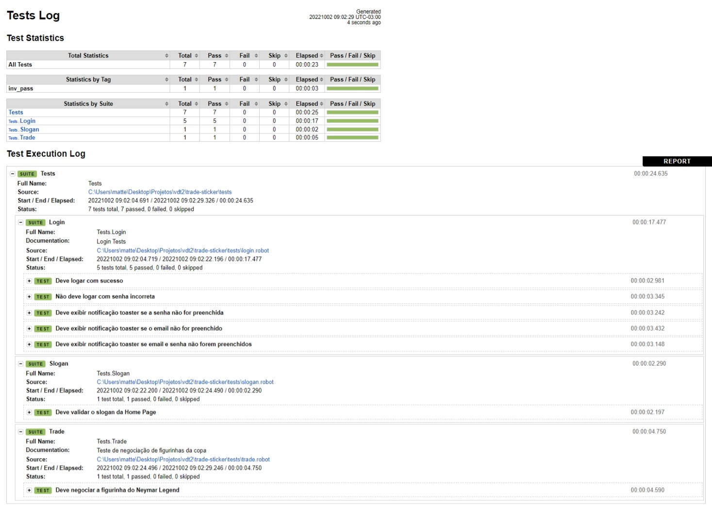
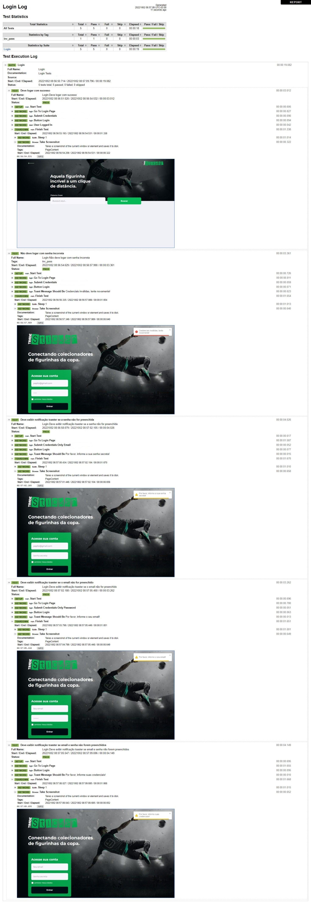

<h1 align="center">🤖 Caso de Teste - Roboto Framework</h1>

  <strong>Projeto em Robot Framework - Testando um sistema de troca de figurinhas da copa da QA Academy</strong>
   

  

  

## Framework: 🚀
- Robot
  - Browser Library - Playwright

## Referências: ⌨️

- [Site](https://trade-sticker-dev.vercel.app/)
